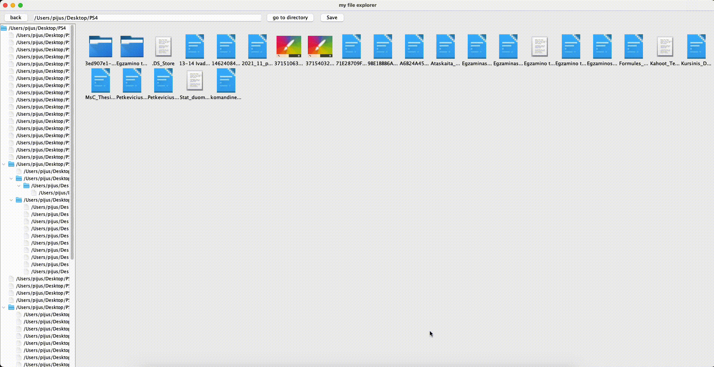

# File Explorer for Object oriented programming course in Vilnius university in spring semester 2021
File explorer project implemented Java Swing GUI.

Custom grid layout to show all files has been implemented.

## Features

- File/Folder creation, renaming and deletion using right click.
- Navigation through the files and directories.
- Saving current location so that on the next session it could be loaded.
- Ability to go to the desired directory(if it exists) when clicked "Go" button in the top panel.

## Demo:
### Custom grid layout


### Navigation


### FileCreation



## Run project

``` bash
make
```

## Update 2024
Did some refactoring, generalized to work on linux and mac.
